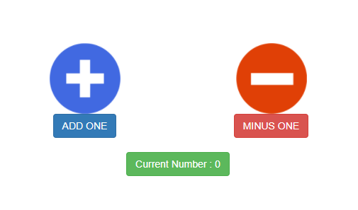

# React-Counter

React & Redux를 사용하여 만든 간단한 웹 어플리케이션 - Counter 입니다.

---

### 웹 어플리케이션 화면

---

### 기능 설명  

- \+ 버튼을 누르면 1씩 증가합니다.

- \- 버튼을 누르면 1씩 감소합니다.

---

### 설치 방법

1 git clone https://github.com/CheolWoongChoi/React-Counter.git [저장할 폴더명]

2 Terminal에서 npm install

3 설치 후, npm start

4 자동으로 웹 브라우저에 어플리케이션 실행됨 (localhost:3000, 로컬 호스트 3000포트)

